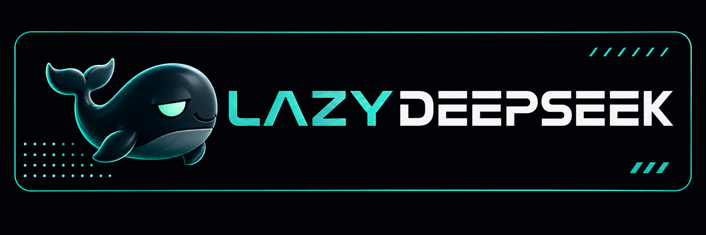

# LazyDeepSeek



[](RELEASE_NOTES.md)
[](LICENSE)
[](#lazyseries-family)

**Describe the work. Keep the plan. Prove the result.**

LazyDeepSeek helps you use structured, evidence-based workflows in **DeepSeek Harness**. It prepares local package assets
and guidance; a host is only considered ready after it is observed in a fresh
session.

[Platform status](docs/reference/platform-status-2026-10-02.md) · [Get started](#recommended-install-with-ai-help) · [Host routes](#choose-one-route) ·
[1.4.0 notes](RELEASE_NOTES.md) · [Family](#lazyseries-family) · [Docs](docs/)

> **Current package version: v1.4.0. HOST READINESS: PENDING.** Local checks and release
> archives prove package behavior; a fresh host session must prove loading,
> command/skill execution and MCP connections.

## What's in 1.4.0

- A shared dashboard core is vendored in the package, with a native DeepSeek
  Harness adapter (`plugins/lazydeepseek/shared/dashboard-host/`) behind an
  authenticated loopback service and a browser UI.
- The status-dashboard MCP server now exposes six tools: the four status views
  plus `dashboard_service` and `copy_task_context`.
- Capability labels are honest: `browser`, `transactional_edits`,
  `project_queue`, `context_copy` and `observations` are available;
  `embedding`, `chat_handoff` and `wake` are unobserved; native host readiness
  stays pending.
- Synthesized hook events remain non-native; the dashboard service does not
  change that boundary. Distribution stays git-spec/GitHub-only; the npm
  registry is not used for this package.
- Runtime checks execute real package and lifecycle paths; unknown exercises and failed checks cannot report success.
- Core and optional TypeScript LSP requirements are checked separately, including unsupported runtimes.
- Hook input is bounded before parsing and stays out of process arguments.
- Platform guides distinguish current native capabilities, legacy routes and integrations awaiting live acceptance.

This is a documentation and surface release. It includes the workflow
foundation introduced in the family since v1.3.0 and subsequent reliability
work; sections before v1.3.4 in the changelog record inherited family history,
not previous public releases of this port. The details below describe the
cumulative v1.4.0 experience; the [release notes](RELEASE_NOTES.md)
distinguish this release's additions from inherited features. No new speed,
token-saving or cost claim is made.

| Family milestone | What you get in the current package |
| --- | --- |
| v1.3.0 foundation | Natural-language entry, editable plans, durable decisions and verification tiers. |
| v1.3.1 reliability | Clearer execution intent, safer isolation and evidence comparisons. |
| v1.3.2 handoff | Revision-bound verification-report contracts; generic completion APIs have separate limits. |
| v1.3.3 hardening | Host-specific hook, MCP and publication repairs. |
| v1.3.4 maintenance | Transactional run integrity, safer lifecycle and native adapter repairs. |
| v1.3.5 repairs | Real runtime exercises, bounded hooks, dependency updates and current platform guidance. |
| v1.4.0 dashboard | Shared dashboard core vendored, native adapter with authenticated loopback service, six-tool status-dashboard MCP, honest capability labels. |

## Shared dashboard surface

The package ships a portable dashboard core
(`plugins/lazydeepseek/shared/dashboard/`, hash-pinned through
`dashboard.vendor.json`) and a DeepSeek Harness-native adapter under
`plugins/lazydeepseek/shared/dashboard-host/`. The adapter is driven by
`cli.mjs start|status|open|stop` and reports `entry: 'browser'` with the
capability labels above.

- The service listens on an authenticated loopback address only; the browser UI
  offers Work, Verification and Plan-edit views, a task inspector, an evidence
  preview dialog, and queue planning.
- Queue planning can create, amend and reorder queued plans; queue edits never
  start work. Edits stay pending until an exact revision is consumed and a
  distinct independent verifier proves them.
- The status-dashboard MCP server exposes `dashboard_service` (start, inspect,
  stop, or return the local browser dashboard entry) and `copy_task_context`
  (copy a validated native producer context without executing or consuming it)
  alongside the four status views.
- Synthesized hook events remain non-native; the dashboard service does not
  change that boundary, and it does not make `embedding`, `chat_handoff` or
  `wake` observed. **HOST READINESS: PENDING** stays authoritative.

### Just ask, or use a command — both work

Two entry routes converge on the same execution authority and gates:

- **Natural language**: describe the work plainly — "Fix the typo in the
  welcome label" — and the smallest sufficient workflow is selected and run.
- **Explicit commands**: `/lazy-ulw-plan <idea>` builds a new plan, and
  `/lazy-start-work <plan>` executes a known plan. Same authority, same gates.

No command is required for a clear implementation request. Conversely, asking
to *explain*, quoting a command, or saying "plan only" never touches your
files: the persisted `execution_intent` stays `plan_only` until you actually
ask for execution, and a vague "ok" with several open questions never grants
execution by itself.

### Plans you can edit while work runs

Plans are Markdown you own. Edit them mid-run; the harness reconciles your
changes at execution boundaries instead of overwriting them:

- Cosmetic wording and ordering edits preserve existing evidence.
- Semantic edits (acceptance, dependencies, verification commands) invalidate
  only the affected task and its dependents — unrelated work is untouched.
- Your checkbox is an *assertion*, not a verdict: a checked box alone never
  counts as verified completion, and unchecking reopens the task.

### Decisions the harness remembers

Cross-plan decisions live in a durable ledger
(`.lazydeepseek/decisions/ledger.jsonl`). When plan two hits a question plan one
already answered — with evidence — it recalls the decision instead of
re-asking you. Contradictions are surfaced as supersessions, defects become
scoped corrections that block only the affected work, and nothing in memory
can override your current instructions.

### Verification sized to the change

The workflow calls for verification sized to the change: a documentation
inspection (V0), a focused check (V1), an integration scenario (V2), or a
comprehensive security/release gate (V3, normally in CI). Valid evidence may be
reused while its inputs match; affected, missing or stale checks must rerun.
Native execution still needs acceptance in the selected host.

Milestones, decision gates, and full state/version semantics are shared
byte-identically with LazyBuddy, LazyTrae, and LazyQoder (see
`plugins/lazydeepseek/contracts/lazyseries-shared-semantics.v1.json`). The DeepSeek Harness
route boundary is unchanged: package
selection never proves host activation.

## Recommended: install with AI help

Open an AI coding assistant in your project and paste this:

> Help me install LazyDeepSeek from https://github.com/elvinzhao10/LazyDeepSeek
> for this project. Read the repository's AGENTS.md and install guide. Verify
> the root package manifest and run safe package checks first. Guide me
> through the dsh git-spec install for that GitHub repository pinned to a
> commit sha, then verify the installed plugin in a fresh session. Ask me
> before installing or enabling the plugin.

The assistant can run local checks and guide the host steps. Installing or
enabling the plugin grants it code-execution trust, so approve those actions
in DeepSeek Harness after reviewing the source.

## Manual setup

### Direct profile setup

1. Confirm the pinned host: `dsh --version` reports exact `0.2.0-rc.2`.
2. After approval, run the git-spec install with the repository URL pinned to
   a full commit sha (or the GitHub release tarball, or `./lazydeepseek` for a
   local development checkout). The npm registry is not used for this package.
   Installed plugins are enabled by default; no build scripts run because the
   prebuilt `lib/` is committed.
   To upgrade an existing installation, install the new verified release SHA
   into the same profile and restart the session so the generated hooks
   configuration is parsed fresh.
3. You need **Node.js LTS 24 (recommended) or 22 (supported alternative)** —
   the lifecycle also accepts Node.js LTS 20 for compatibility — and **Git**
   on `PATH` for the local
   launchers. Try it in a new task: skills appear via the Skill tool
   when the model invokes a loaded skill; registered commands may appear as
   interactive entries such as `/lazy-ulw-plan` where supported; observe them
   rather than inferring visibility from registration.

### Native onboarding

`bash scripts/install.sh` verifies Node.js LTS 20+ and
Git, validates the root dsh bundle manifest and route contract, runs the package load-check and
plugin doctor, and prints the profile-scoped `dsh plugin` install steps with
the GitHub URL (copied to the clipboard on macOS). With
`--project <absolute-project-root>` it additionally runs the durable lifecycle
onboard. Inside DeepSeek Harness, the `/lazy-onboard`, `/lazy-update`, and
`/lazy-offboard` commands walk onboarding, update, and receipt-safe removal
step by step. The git-spec profile steps above stay canonical, and package checks
never prove host readiness — the script ends with **HOST READINESS: PENDING**
until a fresh session shows one real skill/command and all six MCP
connections.

### Durable lifecycle

Manual setup is available when you prefer complete control. You need
**Node.js LTS 24 (recommended) or 22 (supported alternative)** — the lifecycle
also accepts Node.js LTS 20 for compatibility — and **Git**, plus **Python 3.10+** available as `python3`. Start from the
verified origin
`https://github.com/elvinzhao10/LazyDeepSeek` and follow the
[installation guide](docs/03-install-and-host-verification.md).

The git-spec install above is the primary route. For a durable install
that survives source checkouts, run `onboard` once to create a durable
installation; after that, use the stable launcher for `update`, `status`, and
safe `offboard`:

```text
node "<install-root>/LazyDeepSeek/launcher.js" status --project "<absolute-project-root>"
```

## What “ready” means

- **Package readiness** means the copied package and local checks are valid.
- **Host readiness** needs a fresh host session, one real Skill or command,
  and every expected MCP connection.

Until that is observed, the honest result is **HOST READINESS: PENDING**.
Local files and load checks never prove that a host loaded the plugin.

The default package doctor does not discover or execute `dsh` from
`PATH`. Optional host-manifest validation is an explicit action using
`bash scripts/lazydeepseek-plugin-doctor.sh --host-validator /absolute/path`
run from `plugins/lazydeepseek/`.
The release verifier runs classified shell regressions serially, all package
`tests/*.test.js` with conservative Node concurrency, and Python tests under
`tests/` and `tooling/`; its JSON names those outcomes separately.

## Choose one route

Pick one route per project:

- **DeepSeek Harness git-spec install** (`dsh-plugin-git-sha`) is the default
  full-plugin route: skills, commands, native role tools, seven bridged hook events, and six MCP
  rows are composed from one bundle; fresh-session loading is observed separately.

Skills plus manual MCP connectors are a recovery-only
(`manual-skills-mcp-fallback`) option. Do not run that fallback beside a
full-plugin route for the same project. Stop the session, remove only
LazyDeepSeek's previous entries through the host UI, choose one route, and start
a new session to verify it.

## Design mindset

Start with the result you want and how you will know it worked. Then use the
smallest amount of structure that fits the task. You can simply describe the
work in plain language; the modes are guidance, not commands you need to
memorize. The dual-entry routing introduced in v1.3.0 picks one of these for you.

| Mode | Use it when | Example request |
| --- | --- | --- |
| Direct | The change is small and clear. | “Fix this error and run the relevant test.” |
| Assisted | You need help understanding an unfamiliar area or failure. | “Help me find why this command fails, then verify the fix.” |
| Planned | The work has several parts or important choices. | “Make a plan for this feature before changing files.” |
| Orchestrated | The work affects a release, security, or a risky change. | “Review this release and prepare it for publication.” |
| Long-horizon | The goal needs to continue across sessions. | “Keep working on this migration with checkpoints.” |

## Keep host changes deliberate

LazyDeepSeek does not automate credentials, OAuth values, private registries, or
trust settings. It asks for approval before any host-managed action and keeps
safe package checks separate from native plugin installation and connector changes.

## Package inventory

| Surface | Count | Role |
| --- | ---: | --- |
| Skills | 19 | Host-facing workflow policies for planning, execution, review, and verification. |
| Commands | 20 | Named host entry points (slash menu entries) for those workflow policies. |
| Agents | 13 | Specialist role definitions for planning, implementation, QA, security, and context. |
| Hook events | 9 declared / 7 bridged | SessionStart, UserPromptSubmit, PreToolUse, PostToolUse, Stop, SubagentStart, SubagentStop bridge natively. PermissionRequest and PostToolUseFailure are degraded synthesis; child events are advisory. |
| MCP declarations | 6 | Local services for ledger, verification, status, context, code intelligence, and docs. |

## LazySeries family

**One workflow philosophy. Six host integrations.** Choose the sibling for the
host you use; each keeps its own native adapters, installation route and
acceptance evidence. These packages run independently.

| Sibling | Target host |
| --- | --- |
| [LazyBuddy](https://github.com/elvinzhao10/LazyBuddy) | CodeBuddy CLI / IDE · WorkBuddy |
| [LazyTrae](https://github.com/elvinzhao10/LazyTrae) | TraeCode / TraeWork / TraeCode CLI |
| [LazyQoder](https://github.com/elvinzhao10/LazyQoder) | Qoder CLI / IDE / app |
| [LazyZCode](https://github.com/elvinzhao10/LazyZCode) | ZCode |
| [LazyKimi](https://github.com/elvinzhao10/LazyKimi) | Kimi Code CLI · Kimi Work (experimental) |
| [LazyDeepSeek](https://github.com/elvinzhao10/LazyDeepSeek) **← you are here** | DeepSeek Harness 0.2.0-rc.2 |

The family shares planning, evidence, decision-memory and completion contracts.
The first shared verification core and a shared dashboard core are vendored in
every package; product adapters keep host setup and permissions explicit. Matching contracts do not make host capabilities interchangeable. In particular,
Kimi Work remains experimental for LazyKimi, and DeepSeek's synthesized events
are not native hooks. Use each sibling's host guide before installation.

## Technical reference and evaluation

The source-level explanation lives in [docs/README.md](docs/README.md). It
maps the package structure, request flow, state model, security boundaries,
MCP lifecycle, and release checks with diagrams tied to the implementation.

For a capability-by-capability comparison with the original LazyCodex design,
including what LazyDeepSeek implements and where it intentionally differs, see
[lazydeepseek-evaluation.md](lazydeepseek-evaluation.md).

LazyDeepSeek is primarily inspired by LazyCodex. Attribution and its
relationship to OmO are recorded in [NOTICE](NOTICE).
It is an independent implementation and does not require LazyCodex or OmO at
runtime.

## Learn more

- [Install and verify a host](docs/03-install-and-host-verification.md)
- [Workflow playbooks — how the modes pick work](docs/04-workflow-playbooks.md)
- [Evidence and completion — what "done" proves](docs/05-evidence-and-completion.md)
- [Host routes and recovery](docs/reference/host-routes.md)
- [Release notes](RELEASE_NOTES.md)
- [Documentation index](docs/README.md)

## License

[MIT](LICENSE). See [NOTICE](NOTICE) for attribution and provenance.

## Contributing

Issues and pull requests are welcome. Read [CONTRIBUTING.md](CONTRIBUTING.md)
for development checks, release expectations, and guidance for reporting
sanitized reproduction details. Report vulnerabilities privately according to
[SECURITY.md](SECURITY.md).
