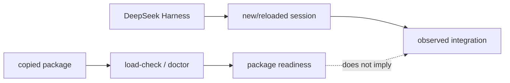

# Package delivery

This page explains the deployment boundary in code terms. A plugin package contains files a host may load; it does not contain the host's profile registry, session state, or connector process table.

## v1.3.4 package route and host readiness

LazyDeepSeek v1.3.4 is prepared as a native DeepSeek Harness plugin: `plugins/lazydeepseek/`
is the payload directory. The repository root is the npm-style package boundary: its `package.json` (`dsh` key plus the
exact `0.2.0-rc.2` peer pin) and `cordis.patch.yml` rows, with the payload under
`plugins/lazydeepseek/`. The public repository is the source for pinned-SHA
installation; fresh host readiness still requires observation. The supported route IDs
are `dsh-plugin-git-sha` (the full-plugin route) and `manual-skills-mcp-fallback` (recovery only, mutually exclusive
with a full-plugin route in the same project). v2 records native mode as
`invoke-documented`, `observe-only`, `descriptor-only`, or `unavailable`;
public label as `documented-tested`, `documented-untested`,
`observed-build-specific`, or `unavailable`; and evidence scope as `package`,
`probe`, or `current-session`. Package readiness does not prove a live host.

Automatic workflow selection uses task risk and complexity to select the
smallest sufficient existing workflow. Before a fresh host observation, this is
only a selection record; it does not prove a workflow loaded or dispatched.

## Durable lifecycle

Prerequisites are **Node.js LTS 24 (recommended) or 22 (supported alternative)**
and **Git**; the lifecycle also accepts Node.js LTS 20 for compatibility (the
lifecycle CLI
and the plugin's MCP launchers are local processes). Bootstrap `onboard`
only from `https://github.com/elvinzhao10/LazyDeepSeek.git`. After promotion use
`node "<install-root>/LazyDeepSeek/launcher.js"` for `update`, `status`, and
plan-first `offboard`. The exact tree is
`LazyDeepSeek/{active.json,launcher.js,releases/,receipts/,rollback/,staging/,locks/}`;
the bootstrap checkout may be deleted.

Default install roots are `~/Library/Application Support/LazySeries` on macOS,
`${XDG_DATA_HOME:-~/.local/share}/lazyseries` on Linux, and
`%LOCALAPPDATA%\LazySeries` on Windows. A moved same-version ref requires
`--confirm-revision <full-sha>`. A stale Node runtime requires scoped
offboard/re-onboard, not receipt edits. Platform paths are package behavior,
not host proof: **HOST READINESS: PENDING** until current observation.

## DeepSeek Harness git-spec install (primary route)

**Recommended first step:** run the native onboarding script from the
repository root:

```bash
bash scripts/install.sh
```

It verifies Node.js LTS 20+ and Git, checks the dsh package boundary (root
`package.json` `dsh` key + `cordis.patch.yml` + committed prebuilt `lib/`,
version agreement), runs `scripts/lazydeepseek-load-check.sh` and
`scripts/lazydeepseek-plugin-doctor.sh` (host=package), prints the exact
install command below with the GitHub repository URL (copied to the clipboard
on macOS), and — with `--project <absolute-project-root>` — additionally runs
the durable lifecycle onboard. It performs no network calls in its package
checks, never edits host configuration, and ends with
`PACKAGE READINESS: full` plus `HOST READINESS: PENDING`. Inside DeepSeek
Harness, the `/lazy-onboard`, `/lazy-update`, and `/lazy-offboard` command
entries guide the same flows on interactive surfaces.

The manual walkthrough remains canonical:

Install LazyDeepSeek into a dsh profile through the `dsh plugin` verb set —
there is no marketplace UI:

1. Confirm the pinned host: `dsh --version` reports exact `0.2.0-rc.2`, and
   `dsh --profile <name> --dump-config` composes cleanly.
2. After approval, run the git-spec install for the repository pinned to a
   full commit sha (the printed form is
   `dsh plugin --profile <name> add <repository-url>#<commit-sha>`). The
   GitHub release tarball asset is the pinned alternate; a local checkout
   installs with `./lazydeepseek` as the spec. The npm registry is not used
   for this package, and no build scripts run (prebuilt `lib/` is committed,
   so the pnpm allowBuilds gate never applies).
3. Prerequisites for the local launchers: **Node.js LTS 24 (recommended) or
   22 (supported alternative)** — the lifecycle also accepts Node.js LTS 20
   for compatibility — plus **Git** and **Python 3.10+** on `PATH`. Enabling
   the plugin grants it code-execution trust.

During development you can validate the package without installing:

```bash
bash plugins/lazydeepseek/scripts/lazydeepseek-load-check.sh
```

That is a package validation, not an install and not host proof.

**Update flow:** select the published release commit or verified archive and
reinstall that pinned spec into the same profile. Maintainers update versions
and regenerate the route contract before publishing; users do not edit them. Source edits are not hot reload; a catalog
refresh is not a plugin update. Generated hooks, launchers, and skills live in immutable receipt-owned
`$DSH_HOME/lazydeepseek/runtimes/<identity>/` directories. Identity includes
package location, runtime content, and profile, so a same-version change gets a
separate directory; the hooks bridge parses its config once per session, so restart the
session after a hooks regeneration.

**Removal flow:** `dsh plugin --profile <name> remove lazydeepseek`, then
confirm the selected bundle rows and processes are absent in a fresh session.
Preserve project `.lazydeepseek/` evidence by default; generated-runtime removal
is a separate exact receipt-owned operation. See [Safe removal](08-safe-removal.md) for the receipt-scoped
protocol.

## Host onboarding

Open or link the durable release selected by `status` in DeepSeek Harness, give the agent
`https://github.com/elvinzhao10/LazyDeepSeek`, and type `onboard`. The agent runs
safe package checks and reports package readiness separately from host
readiness. Before a plugin, Skills, connector, or credential
change it asks for approval, then gives one exact action and waits. After the
response it inspects the host; any reload/new-session step is separate.
Observation happens in a **fresh session**: one real skill/command plus every
expected MCP connection. If host inspection is unavailable, a user-pasted
verbatim status or screenshot is observed evidence; otherwise **HOST
READINESS: PENDING**.

Route status is explicit: the git-spec install route (`dsh-plugin-git-sha`)
is the **default full-plugin route**. The `manual-skills-mcp-fallback` is
recovery only. Package checks never upgrade any route to host proof.

## Copyable versus observed state

`plugins/lazydeepseek/` can be copied and checked in isolation. `scripts/lazydeepseek-load-check.sh` inspects the selected package root, manifests, inventories, declarations, executable scripts, and tooling contract. `scripts/lazydeepseek-plugin-doctor.sh` adds health diagnostics. Neither script asks a host to install a plugin or open an MCP connection.

The host is a second runtime. DeepSeek Harness chooses how plugins are discovered, when
hooks receive events, and when MCP launchers are spawned. The package models
that with declarations and tests; it deliberately does not scan or mutate
host-owned paths to infer success.

## Two evidence channels



The first channel supports claims about package contents. The second supports claims about host loading. Keeping the channels separate is what lets uninstall be safe: package removal cannot guess where a host stored plugin or connector data.

## Delivery surfaces

The **full plugin route** uses the DeepSeek Harness git-spec install flow above. The root
`cordis.patch.yml` composes 19 canonical skills plus ten command-only skill
projections, twenty service command registrations, thirteen full-persona
`dsh-tool-subagent` role tools, seven supported bridge events, and six MCP rows.
PermissionRequest and PostToolUseFailure are degraded synthesized observations.
Interactive command visibility and role dispatch require fresh-session proof;
`.mcp.json` is the package/manual template, not the native registration source.

The recovery-only **`manual-skills-mcp-fallback`** imports
`plugins/lazydeepseek/skills/` only and adds six manual local MCP connectors; it
excludes commands, agents, and hooks. Full plugin/manual coexistence is
unsupported: stop the session, remove only old LazyDeepSeek entries through the
host UI, choose one route, start a new session, and verify it.

### Read-only preflight

Never inspect or mutate private DeepSeek Harness registries or configuration by hand.
This package preflight remains read-only:

```bash
bash plugins/lazydeepseek/scripts/lazydeepseek-dsh-preparation-check.sh \
  --project-dir "<absolute-project-root>"
```

It prints `HOST_PREPARATION=not-applied`, `HOST_MUTATION=none`, and
`HOST_READINESS=pending`; `--apply` refuses.

Automated package verification is defined by the product CI workflows (Ubuntu
and macOS jobs). Supplied host observations are historical macOS reports; they
do not establish a current v1.3.4 host session. A host that has not been
observed in a fresh session remains **HOST READINESS: PENDING** regardless of
package evidence.
The fallback's exact non-mutating six-entry JSON — with absolute
release-local `server.sh` arguments, `cwd`, `CWD`, and `CLAUDE_PROJECT_DIR`
set to the consumer project — is in
[Host routes](reference/host-routes.md#manual-connector-specification).

The detailed host adapters are in [Host capability matrix](10-host-capability-matrix.md)
and [Host routes](reference/host-routes.md).
